# Project Name - Iron Haven Fitness

# Resubmission

  - Debug set to False
  - SEO Meta description tags added to head in base.html and titles added to the anchor links
  - E-commerce business model documentation and marketing strategy added to the readme.
  - fix broken image links in Readme.md.
  - Robots.txt added. 
  - 404.html custom page added.
  - Fix negative number in product price and rating.
  - Test html and css validator, lighthouse and pylint images added to de Readme.md
  - Automatic tests added to Readme.md.
  - Manual test added "spreadsheet image" 

* [Link to Deployed Project](https://ironhavengym-225d29547ff8.herokuapp.com/)

## CONTENTS
* [USER EXPERIENCE (UX)](#user-experience)
  * [Purpose & target audience](#purpose-and-target-audience)
  * [Goals](#goals)
  * [E-commerce business model](#e-commerce-business-model-documentation)
  * [Marketing strategy](#marketing-strategy)
* [PROJECT DESIGN](#project-design)
  * [Wireframes](#wireframes)
  * [User Stories](#user-stories)
  * [Logic](#logic)
  * [Color Scheme](#color-scheme)
  * [Imagery](#imagery)
  * [Typography](#typography)
  * [MVP](#mvp-minimun-vialble-product)
* [FEATURES](#features)
* [VALIDATION](#validation)
* [TECH STACK](#tech-stack)
  * [Languages and Frameworks](#languages-and-frameworks)
  * [Tools and Libraries](#tools-and-libraries)
* [TESTING](#testing)
  * [Tests performed](#tests-performed)
  * [User Story Tests](#user-story-tests)
  * [Bugs resolved](#bugs-resolved)
  * [Unresolved bugs](#unresolved-bugs)
  * [Improvements & future developments](#improvements-and-future-developments)
* [DEPLOYMENT](#deployment)
* [FORKING & CLONING INSTRUCTIONS](#forking-and-cloning-instructions)
* [SECURITY SETTINGS](#security-settings)
* [CREDITS](#credits)
  * [Resources](#resources)
  * [Content](#content)
  * [Media](#media)
  

## USER EXPERIENCE

   ### Purpose and target audience

Iron Haven Fitness is a comprehensive gym website that not only offers memberships but also features a range of products for its members. The site is designed with the goal of clearly presenting the gym’s services, including a detailed schedule of available classes and a dedicated section for products that members can access. Whether you’re looking to join the gym or are already a member, the website provides easy navigation to help you explore everything the gym has to offer and make the most of your membership.

* [Back to Contents](#contents)

  ### Goals
  #### Goals for the first time user
  1. To be able to create an account easily.
  2. To be able to customise and update their profile.
  3. To update and change or cancel their memberships.
  4. To easily be able to reserve or cancel  gym classes if they need it .
  5. To easily be able to purchase for products and see the shopping gab.
  6. To be able to see how much they are going to speend before pay.
  7. To be able to  contact or subscribe yo the gym news.

  #### Goals for the returning user  
  8. All the pages of the app should be secure, so once logged out, the only way to access pages for products and classes is via the login page. 
  9. The app should feel familiar to the returning user.

  #### Goals for the Administrator  
  10. The administrator can easily update or override any information on the backend as a superuser.

  #### Goals for the Site Owner  
  11. The app should have the capacity to scale.  
  12. More choices of classes and products can easily be added and customised. 
  13. Images are validated to ensure they are not oversized dragging on site performance and storage resources.  

* [Back to Contents](#contents)

### E-Commerce Business Model Documentation

1. ### Executive Summary
     #### Overview

    Provide a brief summary of your e-commerce business, including the mission statement, vision, and objectives.

    Example: "Iron Haven Fitness aims to provide top-quality gym memberships, fitness classes, and personal training services through a user-friendly online platform, making fitness accessible and affordable for everyone."

    Business Goals
    List the primary goals of your e-commerce venture.

    Achieve $100 000 in sales within the first year.
    Obtain a customer satisfaction rating of at least 90%.
    Build a community of engaged fitness enthusiasts.

2. ### Business Description
    ####  Business Structure
    
    Define the structure of your business (e.g., sole proprietorship, LLC, corporation) and the rationale behind it.

    Value Proposition
    Describe what makes your business unique and why customers will choose you over competitors.

    - "Iron Haven Fitness offers customized fitness plans, access to exclusive content, and a supportive community, all tailored to meet individual needs."

3. ### Target Market
    
    #### Market Analysis
    
    Conduct research on your target audience, including demographics, preferences, and behavior.

    - Age: 18-45
    - Gender: All
    - Income: Middle to upper-middle class
    - Fitness Enthusiasts and Beginners
    - Customer Segmentation

    Segment your audience into different categories based on specific characteristics.

    - Beginner Gym-Goers: Seeking guidance and support.
    - Fitness Enthusiasts: Looking for advanced training and classes.
    - Families: Interested in group memberships.

4. ### Revenue Model
    #### Revenue Streams
    Identify how your e-commerce business will generate income.

    - Membership Sales: Monthly and annual gym memberships.
    - Personal Training Packages: One-on-one training sessions.
    - Merchandise Sales: Fitness gear and supplements.
    - Online Classes: Virtual fitness courses.

### Marketing Strategy

Our marketing strategy for Iron Haven Gym focuses on building a strong community presence, leveraging digital platforms, and delivering exceptional customer value. Below are the key components of our approach:

* Target Audience

  We are targeting fitness enthusiasts of all levels, ranging from beginners to experienced athletes, in the local area. Our main audience includes:

  - Individuals looking for structured fitness programs.
  - People interested in gym memberships, fitness classes, and personal training.
  - Young professionals and busy individuals who prefer flexible membership plans.
  - Local residents and corporate employees looking to improve their health and fitness.

* Value Proposition

  Iron Haven Gym offers state-of-the-art equipment, experienced trainers, and a welcoming environment for all fitness levels. Our key differentiators include:

  - Flexible membership options tailored to different needs.
  - A wide variety of fitness classes (HIIT, yoga, strength training, etc.).
  - Personal training sessions for customized workout plans.
  - A supportive community and events to engage members beyond their workouts.

* Digital Marketing Channels

  Website & SEO:

  - Optimized for local SEO with targeted keywords (e.g., "gym near me", "personal training [city]", "fitness classes").
  - A user-friendly, mobile-responsive website with clear calls-to-action (membership sign-ups, class bookings).
  - Regular blog posts about fitness tips, healthy living, and gym news to drive organic traffic.
  
  Social Media Marketing:

  - Facebook: Engaging with our community through daily posts, live workouts, and special promotions.
  - Instagram: Sharing success stories, workout videos, and behind-the-scenes content to build brand awareness and create visual appeal.
  - YouTube: Publishing workout tutorials, fitness challenges, and gym tours to attract new members and provide added value to our current members.
  
  Email Marketing:

  - Personalized emails to leads and current members, offering promotions, fitness tips, and news about upcoming events.
  - Monthly newsletters to keep members informed and engaged. 

  Customer Engagement & Retention

  - Member-Exclusive Offers: Regular promotions and discounts for long-term members, such as referral bonuses and loyalty rewards.
  - Community Building: Hosting local fitness events, boot camps, and charity runs to create a sense of belonging and drive word-of-mouth referrals.
  - Feedback & Improvement: Actively collecting feedback from members to continuously improve the services and experience.

  Partnerships & Local Collaborations

  - Collaborating with local businesses, wellness influencers, and nutritionists to offer joint promotions and attract a wider audience.
  - Partnering with corporate entities for employee fitness programs and corporate membership 

  Promotions & Discounts
  - Launch promotions such as a free first class or discounted membership rates for new sign-ups.
  - Seasonal campaigns around New Year’s resolutions, summer fitness goals, and holiday special
   
  Performance Tracking & Analytics

  We will track the effectiveness of our marketing efforts by:

  - Monitoring website traffic and conversion rates through Google Analytics.
  - Tracking engagement, reach, and lead generation across social media platforms.
  - Analyzing email open rates, click-through rates, and membership sign-ups from email campaigns.
  - Our focus is to continuously adapt and refine our strategy based on data, ensuring that we meet our business objectives and create long-term growth.

* [Back to Contents](#contents)

## PROJECT DESIGN

  ### Wireframes

   The initial wireframes were created in [Miro](https://miro.com/es/) to understand how the site would work, and this layout would drive User Stories, the logic required and overall design artwork decisions.

  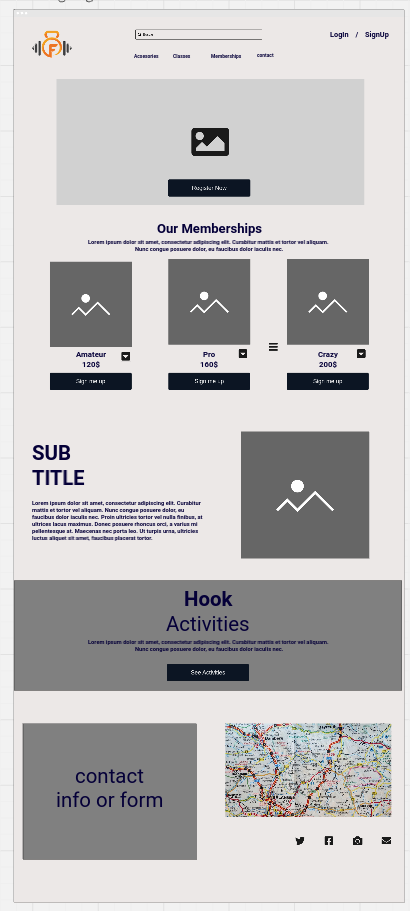
  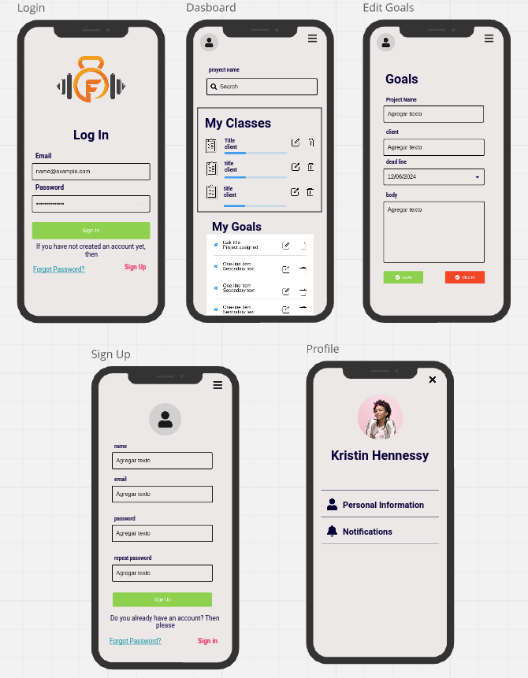
  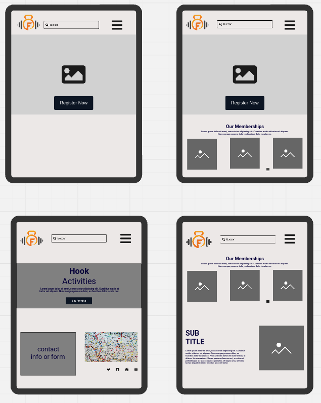

    
   

   

* [Back to Contents](#contents)

  ### User Stories
  All the user stories with their acceptance criteria can be viewed on the next link [GitHub Project board](https://github.com/users/richard9106/projects/10)

  There were  User Stories Created including:

1. [US1] Project General Requirements
    - As a developer, I can understand the goals of the site so that development decisions can be made accordingly.
2. [US2] Setup Repo
    - As a developer, I will set up the repo and install the necessary packages so that I can start building the initial models to manage the information.
3. [US3] Profiles Model
    - As a superuser, I can log in to the admin panel	so that I can manage users and other parts of the system as it develops
4. [US4] Products - Classes and Memberships Model
    - As a superuser, I can create a new products, gym classes and memeberships.
5. [US5] Create NavBar
    - As a website user, I can view the basic navbar so that I can easily navigate the website on desktop and mobile
6. [US6] User Login
    - As a website user, I can log in so that I can access all the functions of the site, and I can easily see if I am logged in or not
7. [US7] User Logout 
    - As a website user, I can log out so that I can protect my profile data, and I can easily see if I need to log in again
8. [US8] User Registration
    - As a website user, I can register for an account and pay my membership secure so that I can access the benefits os a memebership of the site
9. [US9] View Home Page
    - As a user I can view the home page so that I can see all the details about Iron Haven Fitnes
10. [US10] View Profile Page
    - As a logged-in user, I can view my profile to see my details, classes, membership information, and orders from previous purchases.
11. [US11] Edit Profile
    - As a logged in user I can edit my profile so that I can change my personal info
12. [US12] Cancel Classes
    - As a logged-in user, I can cancel any class that I am unable to attend.
13. [US13] Update Username
    - As a logged-in user, I can change my username so that I can change my username if I want to
14. [US14] View all the classes
    - As a logged-in user, I can register for a class and be able to see it on my profile
15. [US15] View all the products
    - As a logged-in user, I can  be able see and purchase for products and easily see my shopping bag
16. [US16] Change my memebership
    - As a logged-in user, I can be able to change my membership.
17. [US17] UX & Testing
    - As a developer, I can test each user story function so that I can verify each function works as intended
18. [US18] Deploy to Heroku
    - As a developer, I can deploy to Heroku so that I can host the site in production
19. [US19] Complete Readme Documentation
    - As a developer, I can submit a comprehensive Readme document so that other developers can understand the project's development process

* [Back to Contents](#contents)

  ### Logic
  The database schema and website logic was conceived and created using [Lucid](https://lucid.app/) as follows:

  Database Structure:

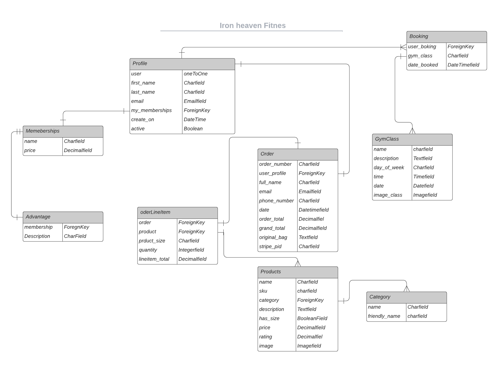

* [Back to Contents](#contents)

  ### Color Scheme
  The main colours of orange, dark blue and white were chosen for maximum contrast. I used [Coolors](https://coolors.co) to generate a colour palette.

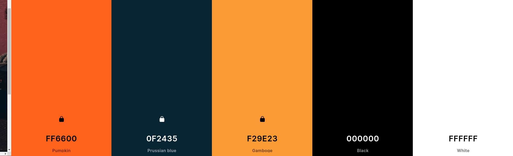

  I used [Canva](https://www.canva.com/) to generate a logo and a style guide.

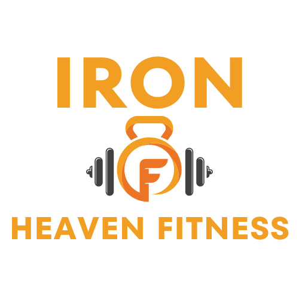

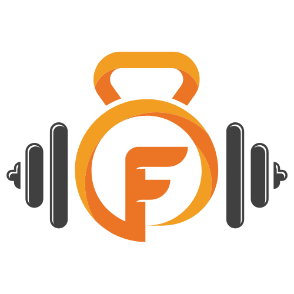

  * [Back to Contents](#contents)

  ### Imagery
  - I used FontAwesome https://fontawesome.com/ for various icons in the navbar, shopping bag, and other places for visual effects.

    

  - I used [Pexels](https://www.pexels.com/es-es/) for free images .

  * [Back to Contents](#contents)

  ### Typography
   * I used a default Google font of Roboto and sans serif throughout the website for visual clarity and consistency.
   * And  Alfa+Slab+One&display font for the title of the home page 
   

  ### MVP (minimun vialble product)

  Using the GitHub project board I prioritised user stories to give me an incremental MVP.
  
  Define the goals or user stories to focus on creating the website’s functionality. I decided not to include specific tasks since that might shift the focus of the functionality.

  Every commit message thoroughly detailed the work that had been completed. trying to been clear.

1. I created the basic models to manage the ecommerce funtionalitie for a gym subscription(membership, profile, home, etc).
2. I built the Navbar and routes
3. I built the Login, Logout and registration functionality
4. I built the Profile Area with CRUD functionality
5. I built the Classes Area with CRUD functionality
6. I built the product Area with CRUD functionality
6. I implemented the functionality for paying memberships, allowing users to make their payment at the same time they register.
7. I implemented the functionality for paying products, allowing users to make their purchase full CRUD and record of the purchase to see in their profiles.

   * [Back to Contents](#contents)

## FEATURES
* The following fully responsive website pages have been implemented:
1. Register / Membership condition
2. Login
3. Home Page,
4. Classes Page / Only registered users can book reservations
5. Accsesories / Only registered users can purchase this products
6. Profile Page / Users can view their information, cancel classes, edit their profile, or cancel their membership.
7. Membership Page / Users can view the price and benefits of each membership option.
8. News Letters
9. Contact form
 
  

    
<u>Click to View Images</u>

      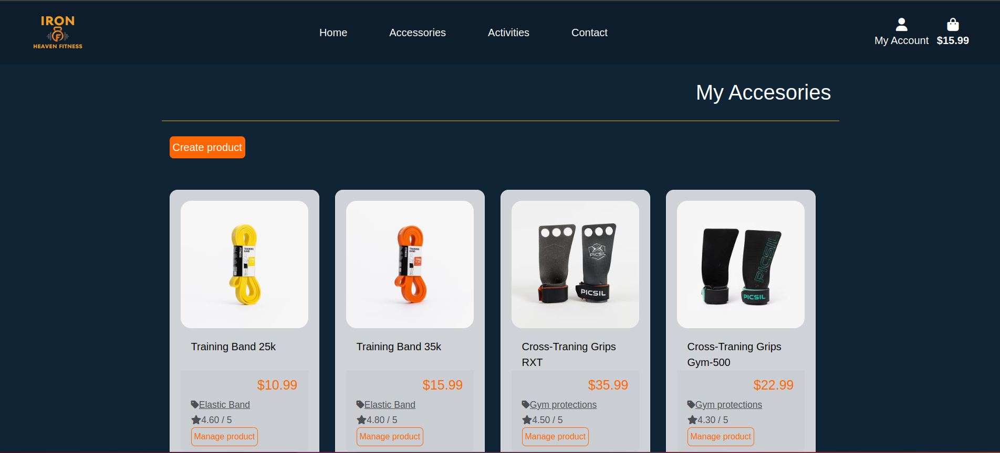
      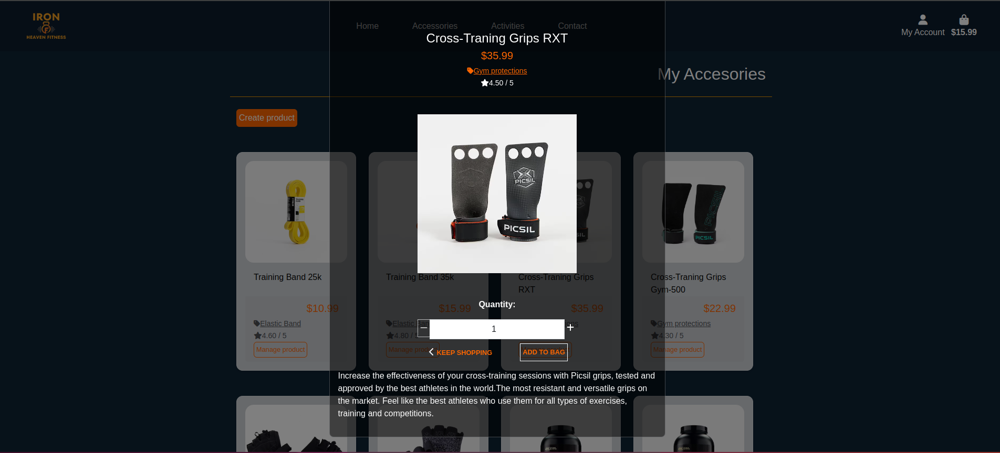
      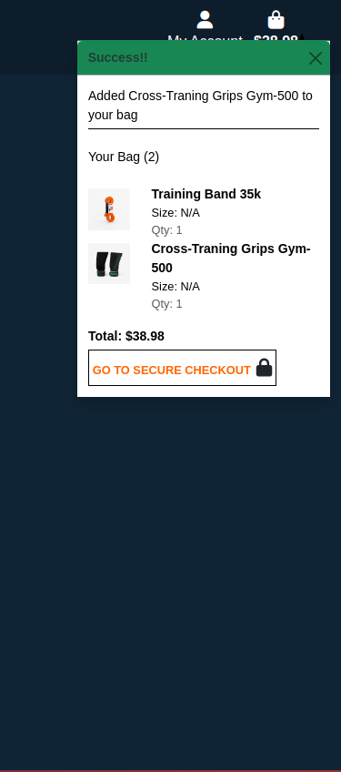
      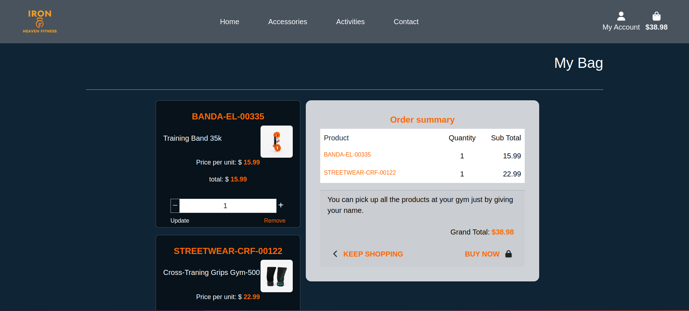
      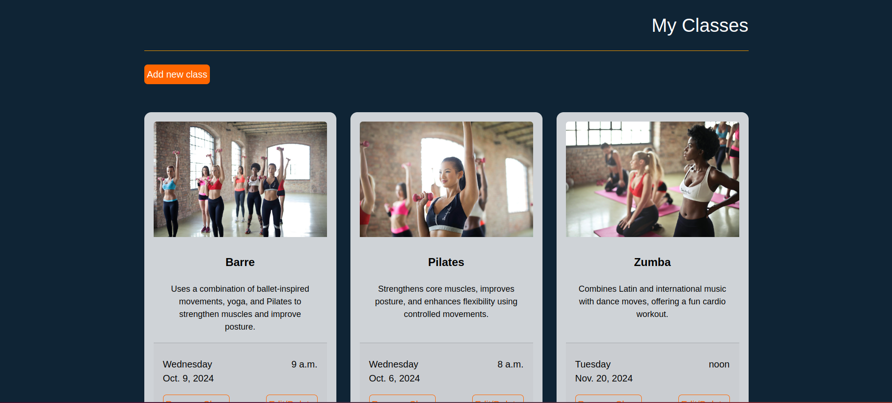
      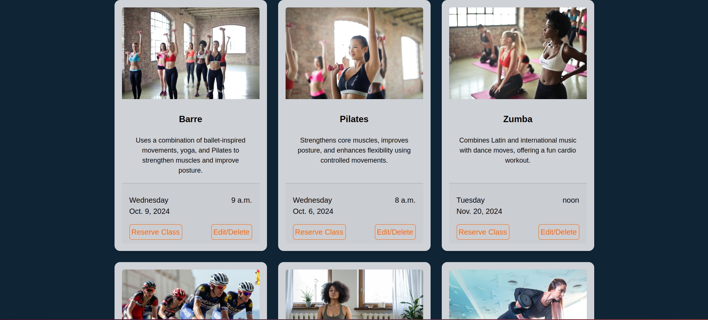
      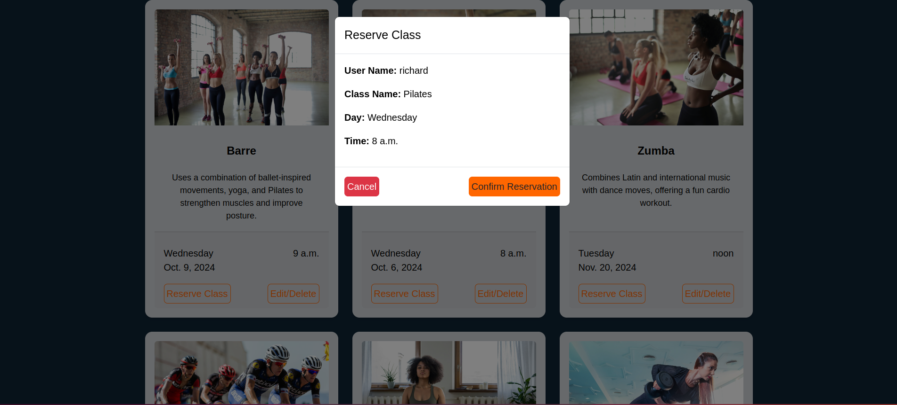
      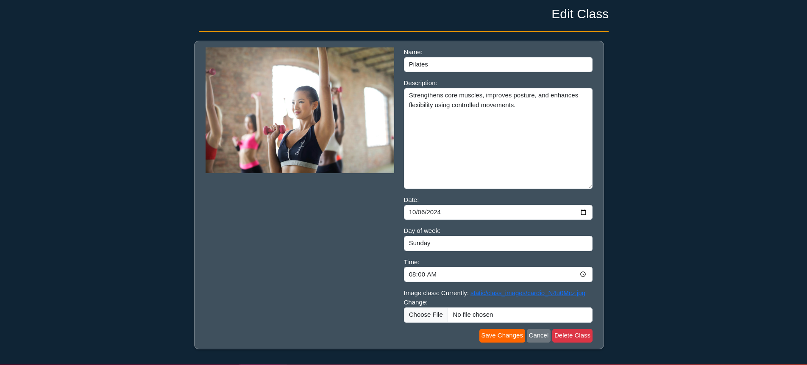
  

  * [Back to Contents](#contents)

## VALIDATION
Various validation methods have been incorporated:
 1. Onscreen success messages after user actions
 2. Re-open forms  as a warnings if form fields have been omitted
 3. Onscreen modal confirmation step before updating or deleting profiles
 4. Date validation to prevent create classes a past date
 5. Classes with past dates are not visible in case the admin forgets to update them.
 6. Once a user has an active membership, they cannot purchase another one from their profile.
 7. Form validation to capture email and phone formats correctly
 8. The newsletter signup form does not save submissions for users who are already subscribed to the newsletter.

 * [Back to Contents](#contents)

## TECH STACK
The site has been built with the following tech, tools and libraries

### Languages and Frameworks

* HTML5
* CSS
* JavaScript
* Python
* Jquery
* Django - web framework
* Django AllAuth - user authentication
* Psycopg2 - postgreSQL adapter for python
* ElephantSQL - database hosting
* Cloudinary - media hosting
* Pillow - python image processing library
* Gunicorn - WSGI HTTP server for UNIX
* Bootstrap 5 and react-bootsrap - frontend responsive styling framework
* Fontawesom icons
* Heroku - live site hosting

### Tools and Libraries
* GitHub Projects - agile management, kanban, roadmap and milestones
* GitHub Repo - code storage
* Git - version control
* GitPod & VS Code - IDE
* [Miro](https://balsamiq.com/) - creating wireframes
* [Coolors](https://coolors.co) - color pallette generator
* [Image resizer](https://www.reduceimages.com/) - resizing images for optimal storage
* [Canva](https://www.canva.com/) - creating artwork
* Google Fonts - consistent typography
* [Lucid Chart](https://lucid.app/) - creating a database schema
* [FontAwesome](https://fontawesome.com/) - icons
* [W3C HTML Validator](https://validator.w3.org/) - html code validation
* [W3C CSS Jigsaw Validator](https://jigsaw.w3.org/css-validator/) - css code validation
* LightHouse - measures performance, accessibility, best practices and SEO
* Chrome Dev Tools - for development debugging
* [CI Python Linter](https://pep8ci.herokuapp.com/) - code analysis tool conforming to pep8
* Prettier - code formatter for html, css and javascript
* ESLint - code analysis tool for javascript

### Refactoring Opportunities

Due to time constraints on completing this project, I wasn’t able to refactor as much as I’d have liked.

1. Automatic renew membership
2. More atractive profile page
3. Spinner to delay processing
4. webhook to manage error payments

* [Back to Contents](#contents)

## TESTING

  ### Tests performed
  The site was thoroughly tested during development with each feature tested before committing to GitHub.  The testing regime included the following:

#### Incremental development and live testing.
- During development, each functionality was tested in real-time, including login verification, profile creation and editing, payments, and other key features. This ensured that any issues were addressed immediately as they arose.

#### Django Models Automated Testing using Jest.
- Automated tests were run on Django models to verify the correctness of the database structure and relationships, ensuring that all data was handled properly throughout the application. 

#### Early user observation test.
- The project was shared with several users to gather feedback on the usability and functionality of the site. They tested key actions such as navigating the website, completing tasks, and providing feedback on the user experience.
#### HTML, CSS, ESLINT, PYLINT, Lighthouse tests.
- The website's HTML and CSS were validated for proper syntax and structure. Additionally, ESLint and Pylint were used to enforce coding standards and identify any potential issues in JavaScript and Python code.
- Lighthouse was used to test the site’s performance, accessibility, and best practices. I also used browser developer tools and responsive design testing tools to ensure the site functioned well across various screen sizes.

#### Browser Compatibility tests.
- The site was tested across multiple browsers, including Chrome, Firefox, and Safari, to ensure consistent behavior and display on different platforms.

#### Final Production user tests
- In the final stages, I personally followed the user flow from start to finish: creating an account, reserving a class, managing profiles, and completing payments. This allowed me to verify that the full experience worked seamlessly and as intended in a live environment.

<u>Auto testting</u>

 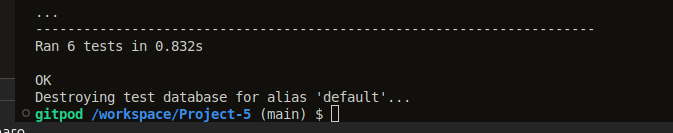

<u>Manual testting</u>

 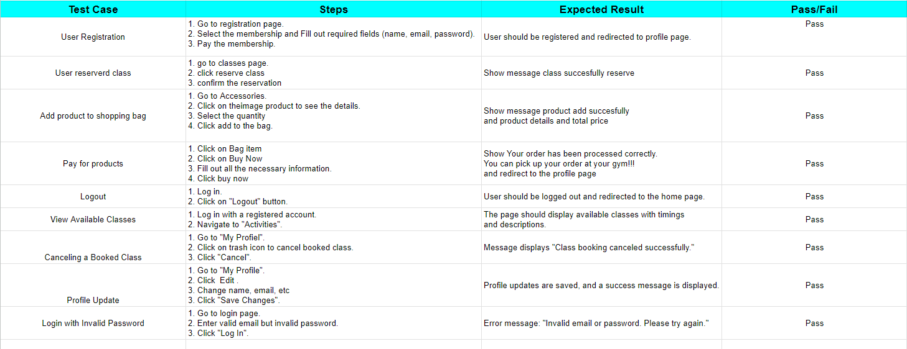

<u>HTML validaor</u>

  ## Home page
  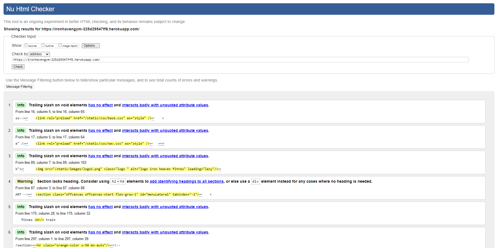
     
     
  ## Classes page
  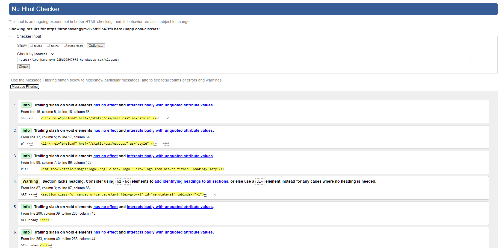
     
  ## Memberships page
  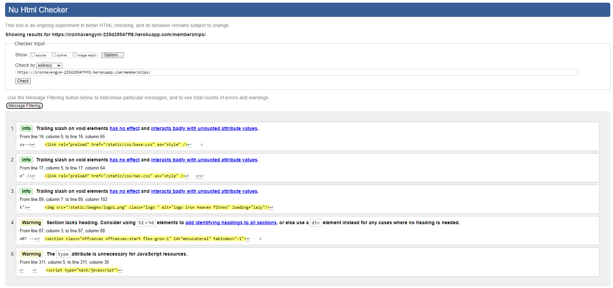
     
  ## Product page
  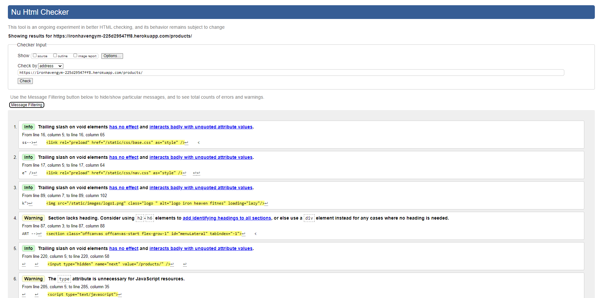
     

<u>CSS validaor</u>

  ## Home page - products - and profiles (base.css)
  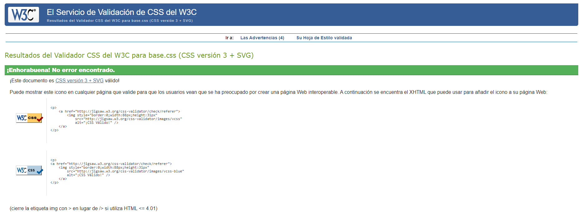
     
     
  ## Classes (classes.css)
  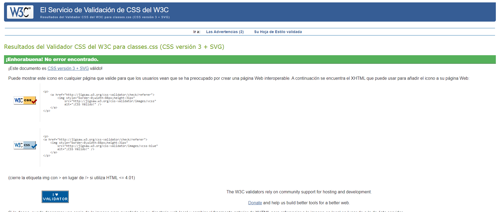
     
  ## Memberships (memberships.css)
  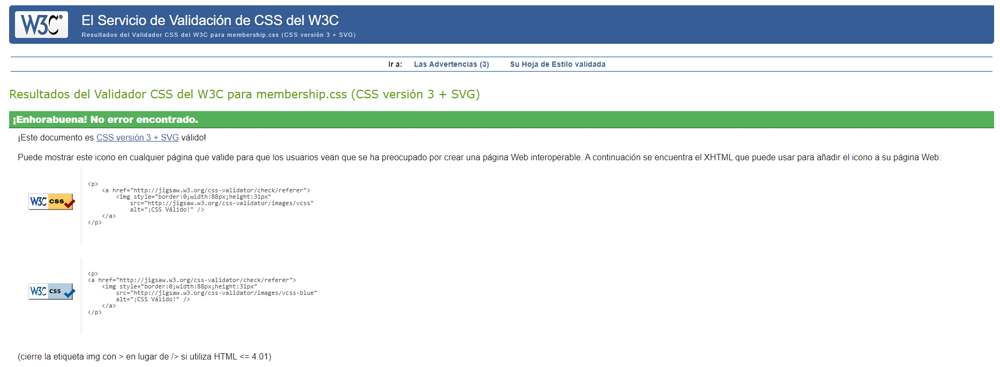
     

<u>Lighthouse validaor</u>

  ## Home page
  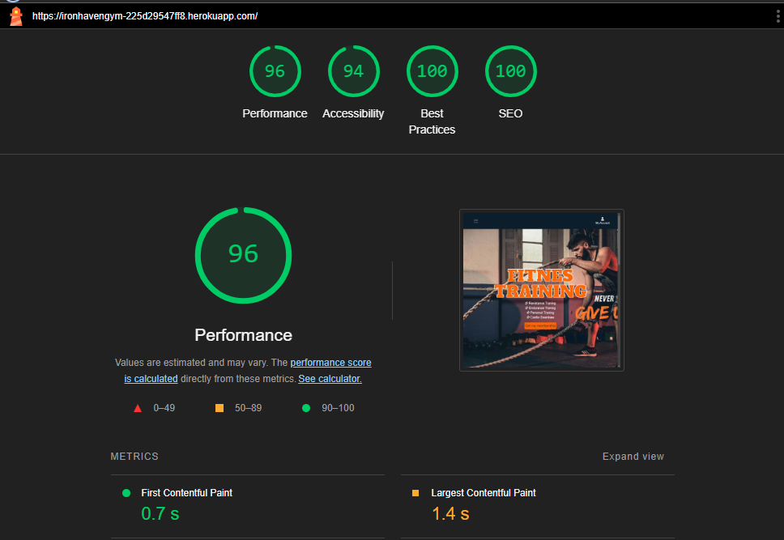
     
     
  ## Classes 
  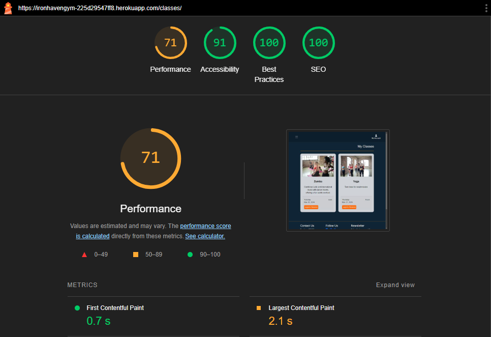
     
  ## Memberships 
  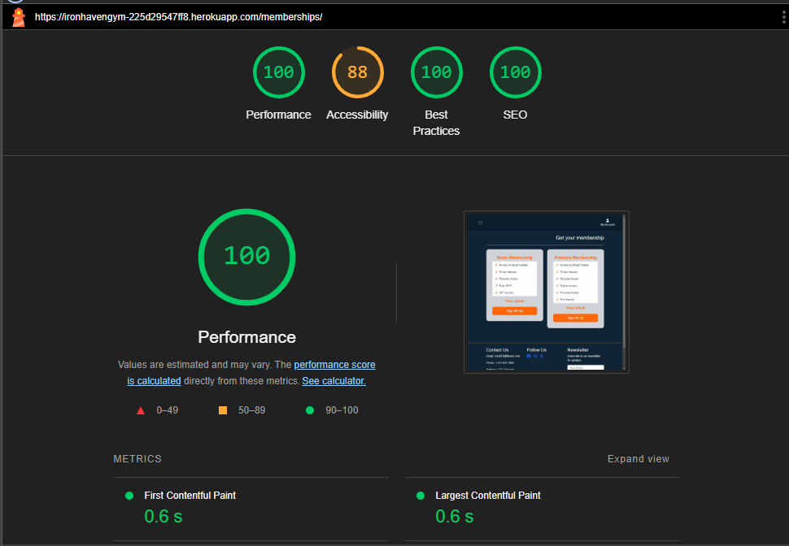

  ## Products 
  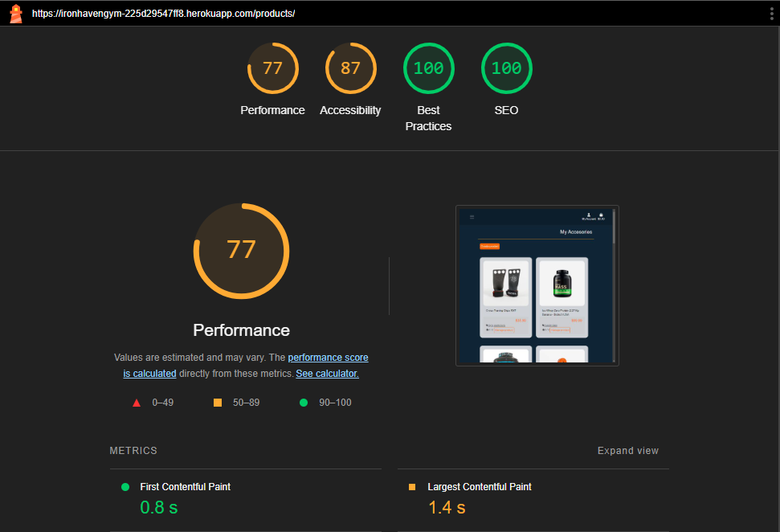

   ## Profiles 
  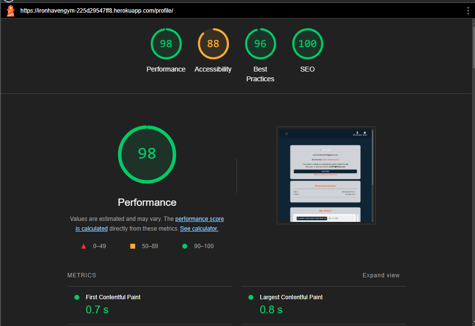
     

<u>CI Python Linter</u>

  ## Profile Model
  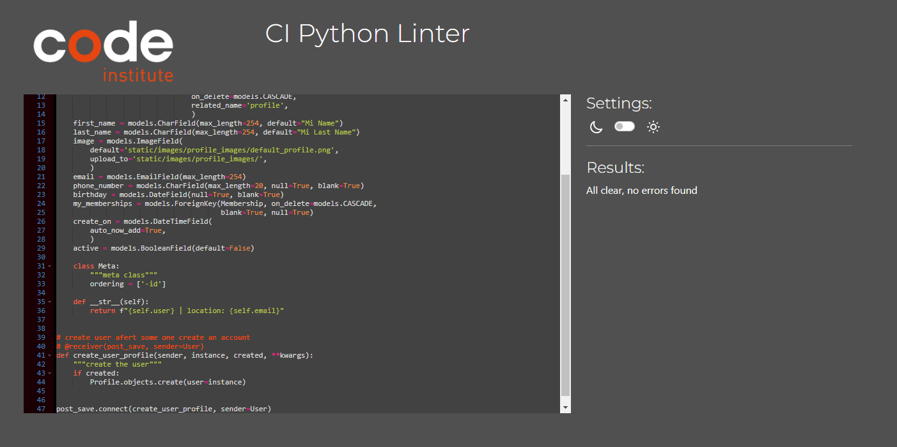
     
     
  ## Classes Model
  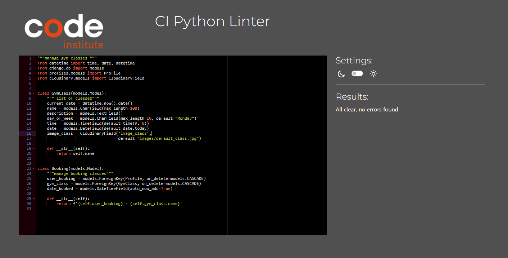
     
  ## Memberships Model
  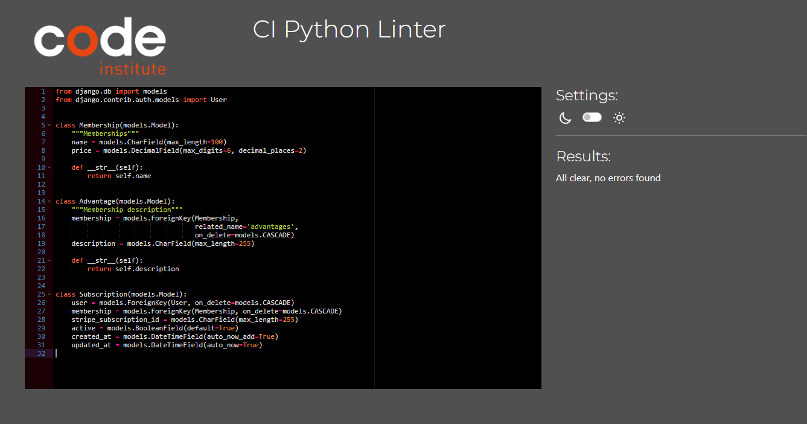

  ## Products Model
  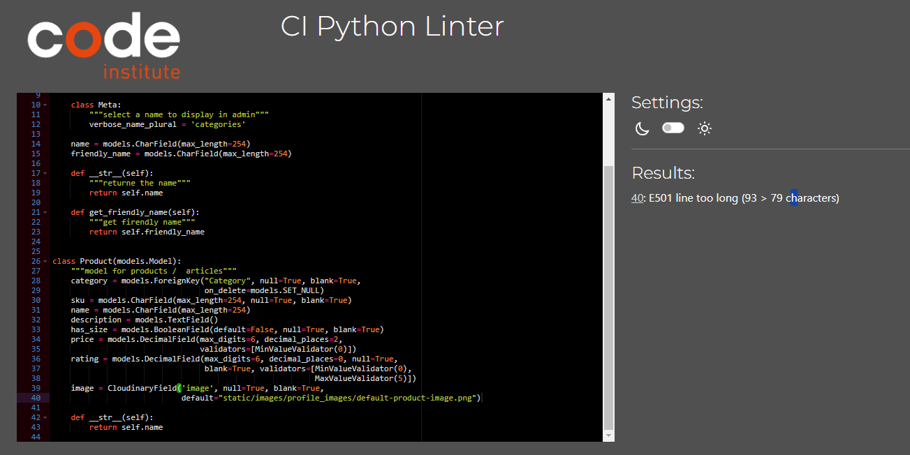

   ## Payments Model
  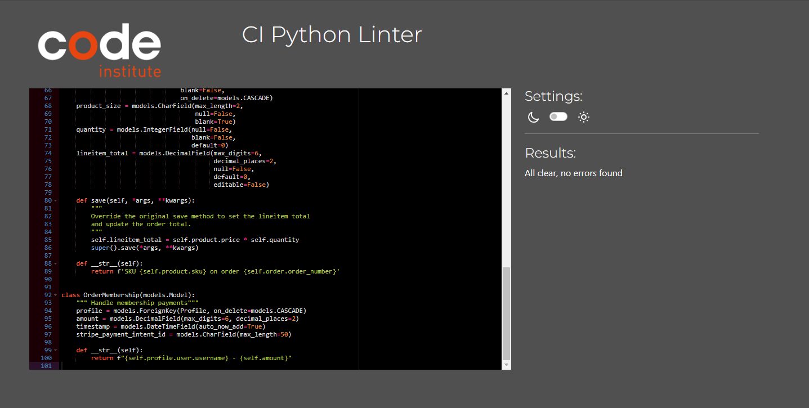
     

  * [Back to Contents](#contents)

### Unresolved bugs:

There are no other known bugs at this time.

### Improvements and future developments:

I did my best with this website, but I’m still not fully satisfied with the result.
* Handle payment errors
* Improve design attractiveness
* Add a banner with offers

  * [Back to Contents](#contents)

## DEPLOYMENT
  for a deployment, keep in mind that depending on the functionalities, some extra configuration may be missing. Very important is the configuration of variables in Heroku and the add-ons since without these activated you will not be able to see the project correctly

  Initially, Django was installed following this Code Institute [DRF Cheatsheet](https://docs.google.com/document/d/1LCLxWhmW_4VTE4GXsnHgmPUwSPKNT4KyMxSH8agbVqU/edit#heading=h.mpopj7v69qqn)

   1. Create a Cloudinary account and gather API key
   2. Create ElephantSQL database and gather API key
   3. Install Django
   4. Create project
   5. Install Cloudinary Storage
   6. Install Pillow (image processing)
   7. Update INSTALLED_APPs
       * all apps in the django project must be make migrations
       * python manage.py makemigrations
       * python manage.py migrate
       * to pass external data to the models if you need it.
          - create the fixture folder
          - add your file.json to the folder
          - python manage.py loaddata 'name.json' 
   8. Create env.py file
       * Add CLOUDINARY_KEY (from Cloudinary API key)
       * Add SECRET_KEY - (a unique password)
       * ADD DATABASE_URL - (postgres ElephantSQL API key)
       * STRIPE_SECRET_KEY 
       * STRIPE_PUBLIC_KEY 
       * DEBUG = True (if you have to push to heroku set False)
   9. Update settings.py
       * CLOUDINARY_STORAGE
       * Define Media Storage URL
       * Set DEFAULT_FILE_STORAGE
       * Set DATABASES
       * set STRIPE settings
    

  ### Deployment to Heroku involved the following steps and changes:
   1. Set up DEBUG in settins.py to False
   2. install gunicorn ==22.0.0
   3. Create a Procfile (web: gunicorn core.wsgi:application) 
   4. Create a runtime.txt file and add the following: Python-3.12.3
   5. Terminate all servers.
       * Ensure DEBUG and DEV in env.py are commented out
       * python3 manage.py runserver
   6. Check project is displaying in the preview on port 8000 or gitpod
   7. Log into your Heroku account, create a new app, and access the dashboard for your application
   8. Go to Settings and open the Config Vars add all the Api keys in your env.py
       * Add CLOUDINARY_KEY (the Cloudinary API key)
       * Add SECRET_KEY - (the unique password)
       * Add DATABASE_URL - (postgres ElephantSQL API key)
       * Add STRIPE_SECRET_KEY - (stripe payments Api key)
   9. Ensure your application has an ALLOWED_HOST your '.herokuapp.com' - '.gitpod.io'
   10. Ensure in Resources in heroku dasboard change your dinos active.
   11. Go to the Deploy tab, connect the project to GitHub, and choose main branch to deploy
       * Click Deploy Branch (manually)
       * (Optional) Select Enable Automatic Deploys

* [Back to Contents](#contents)

## FORKING AND CLONING INSTRUCTIONS
You can create a copy of a GitHub Repository without affecting the original by forking or cloning it.

### Here's a step-by-step guide to forking:
Forking is often used for proposing changes or using the project as a starting point for your own idea. Forking will apear on your GitHub profile.
1. Log into GitHub or sign up for an account.
2. Go to the [Iron Haven Fitness Repository](https://github.com/richard9106/Project-5)
3. Click "Fork" on the right side of the repository's page to create a copy in your own repository.

### Here's a step-by-step guide to cloning:
Cloning is often used for experimenting locally.  It will not show up on your GitHub profile.
1. Go to the [Iron Haven Fitness Repository](https://github.com/richard9106/Project-5)
2. Click the green code button, then the arrow, and select the "clone by https" option to copy the URL.
3. Open your preferred code editor and navigate to the directory where you want to clone the repository.
4. Type 'git clone', paste the copied URL, and press enter. The repository will then be cloned to your machine.

* [Back to Contents](#contents)

## SECURITY SETTINGS
The following precautions were taken regarding the security of the site:
1. An env.py was created at the start of the project, and added to .gitignore, to contain the following settings:
   - CLOUDINARY_URL
   - SECRET_KEY
   - DATABASE_URL
   - STRIPE_SECRET_KEY
   - STRIPE_PUBLIC_KEY
2. These values were added to the Config Vars section of Heroku's Settings page.
3. Heroku is configured with 2FA

* [Back to Contents](#contents)

## CREDITS:
The entire concept was created specifically for this assessment and is not a copy of any other project.

Initially, parts of the project were based on the Moments walkthrough project:
  * CI Template for setting up the repo - [View Here](https://github.com/Code-Institute-Org/cra-template-moments)
  * The Profile Model - similar to the Mind Well project 4 Profile model
  * The Bag, Payments, and Product models are similar to those in Boutique Ado but have been further customized for specific needs.
  * Example readme.md from - [View Here](https://github.com/rstan-dev/GarageGuru-PP5?tab=readme-ov-file#logic)

  ### Code
  * All Python logic was written and developed specifically for this project, using the Boutique ado  Build an Ecommerce as a reference.
  * All frontend HTML, CSS, JavaScript were incrementally written specifically for this project.

  * [Back to Contents](#contents)

  ### Resources
  I used the following resources to help develop features and functionality:
 
  * ChatGPT was used to help troubleshoot and explain code functions
  * Google and StackOverflow were also used for more context and understanding
  * I reached out to Code Institute team members and tutor support from time to time

  * [Back to Contents](#contents)

  ### Media
  * The Iron Haven Fitness logo was custom-designed for this project.
  * Logo icon created in Canva Pro.
  * images from pexel
  * Icons - font awesome.

  * [Back to Contents](#contents)

